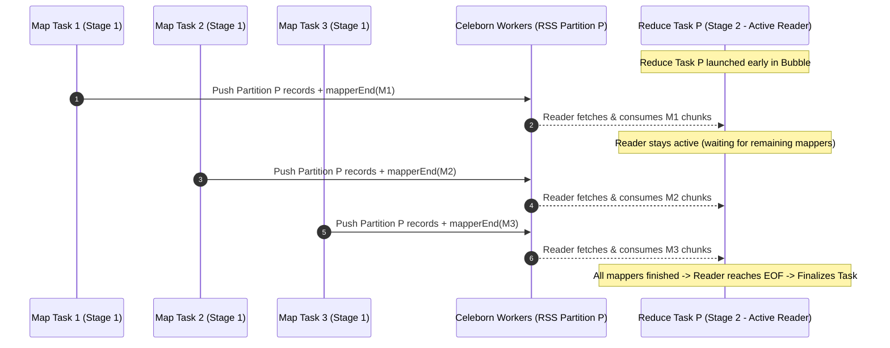

<!--
Licensed to the Apache Software Foundation (ASF) under one
or more contributor license agreements.  See the NOTICE file
distributed with this work for additional information
regarding copyright ownership.  The ASF licenses this file
to you under the Apache License, Version 2.0 (the
"License"); you may not use this file except in compliance
with the License.  You may obtain a copy of the License at

  http://www.apache.org/licenses/LICENSE-2.0

Unless required by applicable law or agreed to in writing,
software distributed under the License is distributed on an
"AS IS" BASIS, WITHOUT WARRANTIES OR CONDITIONS OF ANY
KIND, either express or implied.  See the License for the
specific language governing permissions and limitations
under the License.
-->

# Bubble Scheduling with Apache Celeborn RSS

## Overview

In standard Apache Spark, stage execution is strictly barrier-based: **Stage $N+1$ (downstream reduce stage) cannot start until Stage $N$ (upstream map stage) has finished 100% of its tasks**. This introduces idle resource bubbles (stragglers in Stage $N$ cause executors assigned to Stage $N+1$ to sit idle, increasing job makespan and memory buffer retention).

**Bubble Scheduling** enables downstream reduce tasks to launch and stream shuffle data from **Apache Celeborn (Remote Shuffle Service)** concurrently while upstream map tasks are still running.



---

## Core Architectural Concepts

1. **Active Streaming Shuffle Reads**:
   In an all-to-all shuffle, every upstream mapper produces records for every downstream partition $P_k$. Downstream tasks begin consuming partition chunks from Celeborn workers as mappers commit to Celeborn's `LifecycleManager` (LM), reaching EOF only when `LifecycleManager` confirms the upstream stage is completely done.

2. **Bounded Sliding Window Dispatch**:
   If a query has 200 shuffle partitions (`spark.sql.shuffle.partitions = 200`), launching all 200 tasks concurrently would saturate the cluster and deadlock upstream mappers. `BubbleDAGScheduler` calculates a bounded concurrency window $W$:
   $$W = \min\left(M_{\text{partitions}}, \lfloor \text{TotalClusterCores} \times (1 - \text{upstreamCoreFraction}) \rfloor\right)$$
   Only $W$ tasks are launched initially. When a downstream task completes, the next pending partition task is automatically dispatched.

3. **Core Reservation & Deadlock Prevention**:
   Guarantees that at least `spark.shuffle.bubble.upstreamCoreFraction` (default 50%) of executor cores are reserved for upstream map stages so they can always make progress.

4. **Fail-Fast Cancellation**:
   If an upstream map task fails and triggers a retry, active downstream tasks in flight are cancelled and rescheduled once the retried mapper completes.

5. **Non-Invasive Driver Plugin Injection**:
   `BubbleDriverPlugin` attaches `BubbleDAGScheduler` dynamically at runtime via `--conf spark.plugins=org.apache.spark.scheduler.BubblePlugin`, requiring zero modifications to Apache Spark binaries.

---

## Configuration Reference

| Configuration Property | Default | Description |
| :--- | :--- | :--- |
| `spark.shuffle.bubble.enabled` | `false` | Master toggle to enable Bubble Scheduling. |
| `spark.shuffle.bubble.minUpstreamTasksThreshold` | `10` | Minimum tasks in an upstream stage to activate bubble scheduling (stages with fewer tasks fall back to standard barrier scheduling). |
| `spark.shuffle.bubble.minUpstreamCompletionFraction` | `0.2` | Fraction of upstream tasks that must finish before evaluating downstream readiness (range `0.0` to `1.0`). |
| `spark.shuffle.bubble.upstreamCoreFraction` | `0.5` | Fraction of cluster cores reserved for upstream mapper stages to prevent deadlock. |
| `spark.shuffle.bubble.maxActiveDownstreamTasks` | `0` (Auto) | Hard cap on active downstream tasks (`0` auto-calculates from core budget). |
| `spark.shuffle.bubble.maxConcurrentStages` | `2` | Maximum concurrent pipelined stages. |
| `spark.shuffle.bubble.readerPollTimeoutMs` | `100` | Polling wait timeout in milliseconds for streaming readers. |

---

## Testing & Verification Guide

### 1. Running Automated Unit & Integration Tests

Run the full Bubble Scheduling test suite using Maven:

```bash
./mvnw test -Dtest=none -Dsuites="org.apache.spark.scheduler.BubbleDAGSchedulerSuite,org.apache.spark.scheduler.BubbleIntegrationSuite" -Pspark-3.5
```

Test Coverage:
* `BubbleDAGSchedulerSuite`: Config parsing, small-stage fallback, sliding window size calculation, mapper completion tracking, and fail-fast cancellation.
* `BubbleIntegrationSuite`: `BubbleDriverPlugin` runtime injection, end-to-end multi-stage aggregation correctness against ground truth, and sliding window execution under constrained core budgets.

---

### 2. Setting Up the Local Celeborn 0.7.0 Testbed

The project includes Celeborn 0.7.0 services configured in `polaris-minio-setup/docker-compose.yml`.

#### Start the Celeborn cluster with Podman Compose:
```bash
podman compose -f polaris-minio-setup/docker-compose.yml up -d
```

#### Verify Celeborn Services:
* **Celeborn Master Web UI**: Open [http://localhost:9098](http://localhost:9098) in your browser.
* **Celeborn Master RPC**: `localhost:9097`
* **Celeborn Worker Port**: `localhost:9096`

#### Stop the Celeborn cluster:
```bash
podman compose -f polaris-minio-setup/docker-compose.yml down
```

---

### 3. Interactive Testing with `spark-shell`

Launch an interactive Spark Shell configured with `BubblePlugin` and Celeborn RSS using the helper script:

```bash
export SPARK_HOME=/path/to/spark
./benchmarks/bubble/run-bubble-spark-shell.sh
```

Or manually:
```bash
$SPARK_HOME/bin/spark-shell \
  --conf spark.plugins=org.apache.spark.scheduler.BubblePlugin \
  --conf spark.shuffle.bubble.enabled=true \
  --conf spark.shuffle.bubble.upstreamCoreFraction=0.5 \
  --conf spark.shuffle.bubble.minUpstreamTasksThreshold=10 \
  --conf spark.shuffle.bubble.minUpstreamCompletionFraction=0.2 \
  --conf spark.shuffle.manager=org.apache.spark.shuffle.celeborn.SparkShuffleManager \
  --conf spark.celeborn.master.endpoints=localhost:9097
```

#### Run a Sample Multi-Stage Query:
```scala
val df = spark.range(0, 1000000)
  .repartition(200)
  .groupBy($"id" % 50)
  .count()

df.show()
```

---

### 4. Visual Verification on Spark UI

1. Open the Spark Web UI at [http://localhost:4040](http://localhost:4040).
2. Navigate to the **Jobs** tab and click on the active job.
3. Open the **Event Timeline**:
   - In standard Spark, Stage 1 tasks and Stage 2 tasks are separated by a strict vertical barrier line.
   - Under **Bubble Scheduling**, you will observe **overlapping task bars** where Stage 2 tasks launch while the final wave of Stage 1 tasks is still completing.
